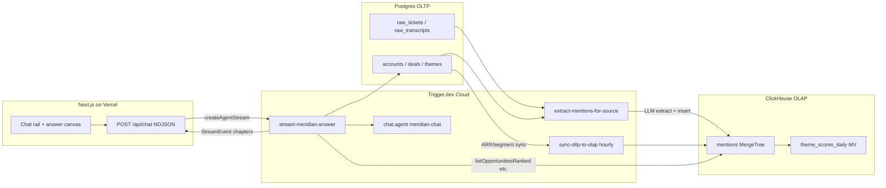

# Meridian Architecture

Product intelligence agent for Meridian Payments Billing PMs. Answers
"what should we prioritize next quarter?" from support tickets, interview
transcripts, CRM deals, and competitive intel — as visual chapters, not
walls of text.

## Why OLTP + OLAP

| Layer | Store | Owns | Answers |
| --- | --- | --- | --- |
| **OLTP** | Postgres (ClickHouse-managed) | Mutable business state: accounts, deals, themes, competitors, raw tickets/transcripts | "What is this account's ARR right now?" / "Which deal blocked on theme X?" |
| **OLAP** | ClickHouse Cloud | Append-only analytical signal: `mentions` (~1.8k rows) + `theme_scores_daily` MV | "Across all signal, what matters most?" / ARR-weighted rankings, trends, evidence |

Denormalized `account_arr` / `account_segment` on every mention keep ranking
queries in ClickHouse. The `sync-oltp-to-olap` Trigger task propagates ARR /
segment changes from Postgres → ClickHouse so aggregations stay current
without re-extraction.

## System diagram

## Agent contract

Frontend consumes **NDJSON `StreamEvent`s** (`types/chapter.ts`):

`message_start` → `status*` → (`chapter_start` → `chapter_intro_delta*` → `chapter_visual` → `chapter_callout*`)* → `message_end`

Hybrid orchestration: **scripted chapter sequence** for "what should we
prioritize?" (demo reliability); **LLM + tools** via `chat.agent()` for
open follow-ups. Visual `data` for ranking / evidence / matrix / impact is
literal query output from `types/agent-tools.ts`.

## Data path

1. Seed accounts/themes/competitors → Postgres
2. Generate tickets / transcripts / deals → Postgres
3. `extractAllMentions` fans out via `batchTrigger` → ClickHouse `mentions`
4. Agent queries ClickHouse (+ Postgres for names / competitor matrix)
5. Hourly sync keeps denormalized ARR/segment fresh

## Verified production numbers (2026-07-21)

| Artifact | Count |
| --- | ---: |
| Accounts | 123 |
| Support tickets | 956 |
| Interview transcripts | 63 |
| Deals (lost with blocking theme) | 11 |
| Extracted mentions (ClickHouse) | ~1,801 |
| Themes | 8 |
